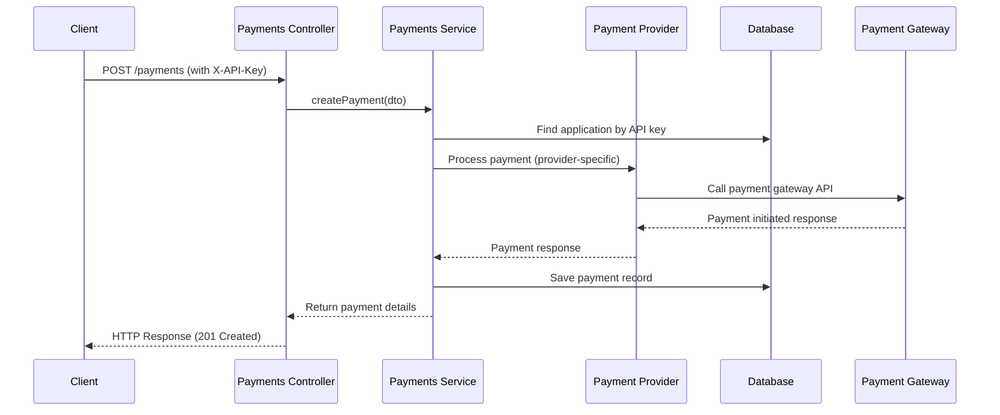
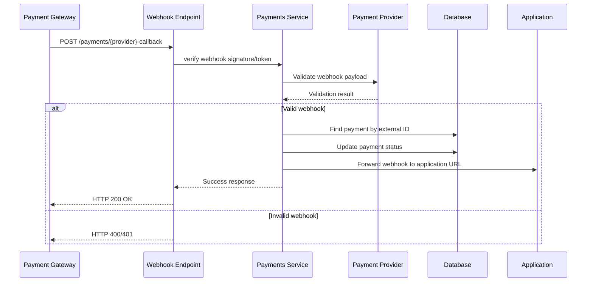

# System Architecture

This document provides a detailed overview of the PGLink Payment Aggregator's architecture, design patterns, and technical decisions.

## High-Level Architecture

PGLink follows a modular, layered architecture built with NestJS that separates concerns and promotes maintainability:

```
┌─────────────────┐    ┌──────────────────┐    ┌────────────────────┐
│   API Layer     │    │ Business Logic   │    │  Data Access       │
│ (Controllers)   │───▶│ (Services)       │───▶│ (Repositories/     │
└─────────────────┘    └──────────────────┘    │  TypeORM Entities) │
                                                └────────────────────┘
           ▲                                             │
           │                                             ▼
┌─────────────────┐                            ┌──────────────────┐
│ Cross-Cutting   │                            │ External       │
│ Concerns        │                            │ Services       │
│ (Guards,        │                            │ (Xendit,       │
│  Interceptors,  │◀───────────────────────────┤  Midtrans,     │
│  Pipes,         │                            │  Email, etc.)  │
│  Filters)       │                            └──────────────────┘
└─────────────────┘
```

## Module Structure

The application is organized into feature modules following NestJS best practices:

### 1. Applications Module

Handles application lifecycle management:

- Registration of new applications
- API key generation and management
- Application configuration (webhook URLs, status)
- Application listing and retrieval

### 2. Payments Module

Core payment processing functionality:

- Payment request creation and validation
- Provider abstraction layer
- Payment status tracking
- Subscription management
- Webhook handling for provider callbacks

### 3. Admin Module

Administrative dashboard and monitoring:

- Payment analytics and reporting
- Application management interface
- Transaction monitoring
- System health checks

### 4. Common Module

Shared components used across modules:

- Authentication guards (JWT, API key)
- Custom decorators
- Shared interfaces and DTOs
- Exception filters and pipes
- Configuration services

## Key Design Patterns

### 1. Provider Abstraction Pattern

Payment providers (Xendit, Midtrans) implement a common interface:

```typescript
interface PaymentProvider {
  createPayment(paymentDto: PaymentDto): Promise<PaymentResponse>;
  verifyWebhook(request: Request): Promise<boolean>;
  handleWebhook(payload: any): Promise<WebhookResult>;
  // ... other common methods
}
```

This allows:

- Easy addition of new payment providers
- Isolation of provider-specific logic
- Consistent interface for the payment service
- Simplified testing through mocking

### 2. Dependency Injection

NestJS's built-in DI container is used extensively:

- Services injected into controllers
- Repositories injected into services
- Configuration services injected where needed
- Providers injected into payment service

### 3. Strategy Pattern (Authentication)

Multiple authentication strategies:

- JWT Auth Guard for application management endpoints
- API Key Guard for payment processing endpoints
- Both strategies use a common interface but different implementations

### 4. Repository Pattern (TypeORM)

Data access abstraction:

- TypeORM repositories encapsulate database logic
- Services interact with repositories rather than direct queries
- Enables easier testing and potential ORM swaps

## Data Flow

### Payment Processing Flow



### Webhook Processing Flow



## Technology Choices

### Backend Framework

- **NestJS**: Provides modular architecture, dependency injection, and TypeScript support
- Why: Built for enterprise Node.js applications, excellent documentation, CLI tools

### Database

- **PostgreSQL**: Relational database with strong ACID compliance
- **TypeORM**: ORM that supports PostgreSQL with decorator-based entities
- Why: Reliable, feature-rich, good performance, strong community

### Authentication

- **JWT (JSON Web Tokens)**: For application management API security
- **API Keys**: For payment processing endpoint security
- Why: Standard, stateless, scalable authentication mechanisms

### HTTP Client

- **Axios**: Promise-based HTTP client for provider communications
- Why: Simple, widely used, good error handling, interceptors

### Testing

- **Jest**: Testing framework
- **Supertest**: HTTP assertion library for testing endpoints
- Why: Popular, well-maintained, good mocking capabilities

### Code Quality

- **TypeScript**: Static typing for catch errors at compile time
- **Prettier**: Code formatting
- **ESLint**: Code quality and style checking
- Why: Maintainability, consistency, early error detection

## Security Considerations

### Data Protection

- Environment variables for secrets (never hardcoded)
- Passwords/API keys stored in environment, not in code
- Database connection pooling with secure credentials

### API Security

- JWT tokens for admin/management routes
- API keys in header for payment routes
- Rate limiting (can be implemented via middleware)
- Input validation via class-validator and DTOs
- CORS configuration via NestJS built-in support

### Webhook Security

- Xendit: Verified via `x-callback-token` header
- Midtrans: Verified via SHA256 signature
- Applications must verify `X-API-Key` header matches their key

### Database Security

- TypeORM parameterized queries prevent SQL injection
- Connection pooling with proper cleanup
- SSL/TLS support for database connections

## Scalability Features

### Horizontal Scaling

- Stateless services (except for local file operations)
- Database connection pooling
- Redis-ready architecture (for caching/sessions)

### Performance Optimizations

- Efficient database queries with proper indexing (via TypeORM)
- Asynchronous processing where possible
- Efficient JSON serialization/deserialization

### Extensibility

- Adding new payment providers requires implementing the `PaymentProvider` interface
- Configuration-driven feature flags
- Modular design allows for feature isolation

## Deployment Considerations

### Environment Specifics

- Development: `synchronize: true` for automatic schema updates
- Production: `synchronize: false` with migration scripts
- Logging levels configurable per environment

### Containerization

- Dockerfile optimized for Node.js production builds
- Multi-stage build to reduce image size
- Health check endpoint for orchestration systems

### Monitoring

- Built-in NestJS logging with Winston
- Structured logging for easier parsing
- Metrics collection ready (can integrate with Prometheus)

## Future Enhancements

### Planned Improvements

1. **Caching Layer**: Redis integration for frequently accessed data
2. **Event-Driven Architecture**: Message queues for asynchronous processing
3. **Advanced Analytics**: Built-in reporting and dashboard features
4. **PCI DSS Compliance**: Enhanced security for card data handling
5. **Multi-tenancy**: Improved isolation between applications
6. **API Versioning**: Support for backward-compatible API evolution

### Technical Debt Items

1. **Migration Strategy**: Move from synchronize=true to migration-based schema updates
2. **Circuit Breaker**: Implement resilience patterns for external service calls
3. **Rate Limiting**: Add configurable rate limiting per application/API key
4. **Audit Trail**: Comprehensive logging of all payment-related actions
